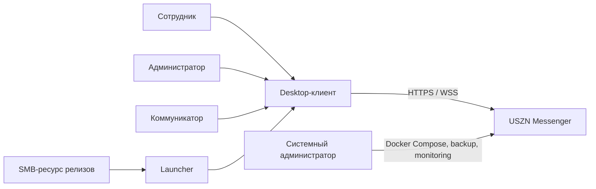
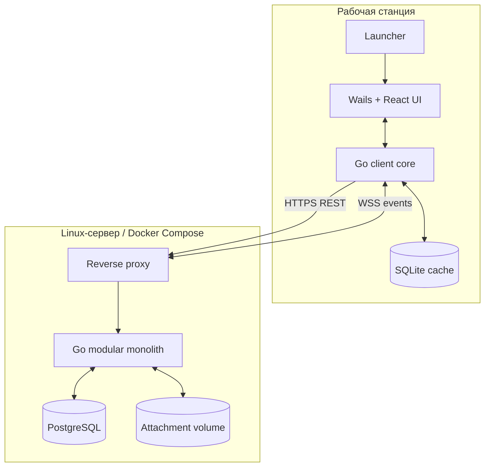
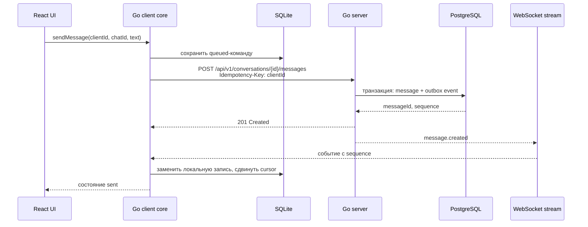
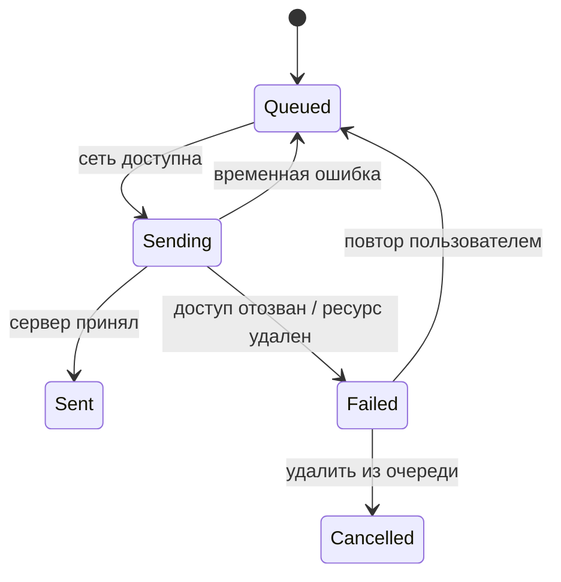
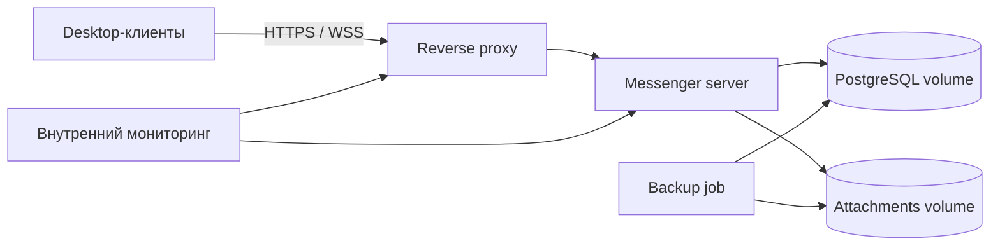
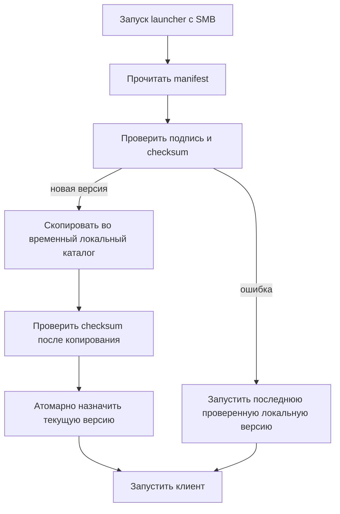

# Архитектура

## 1. Контекст и ограничения

Система обслуживает одну организацию в изолированной сети. Desktop-клиенты подключаются только к внутреннему адресу reverse proxy; серверные компоненты не обращаются во внешние сервисы.

Расчетная нагрузка: до 500 учетных записей и 200 одновременно подключенных клиентов. Для этой границы выбран один экземпляр серверного приложения без отдельного брокера сообщений. Переход к нескольким экземплярам требует внешней координации WebSocket-соединений и оформляется отдельным ADR.

## 2. Контейнеры системы

### Desktop-клиент

- **React/TypeScript UI:** представление, маршрутизация, темы, доступность и UX-состояния.
- **Go client core:** сетевой транспорт, токены, очередь команд, файловые операции, интеграция с ОС и SQLite.
- **SQLite:** разрешенный пользователю кеш диалогов, сообщений, справочников, курсора и исходящей очереди.
- **Wails v2:** desktop-оболочка и типизированный мост между React и Go.

Windows-сборка зависит от Microsoft WebView2 Runtime. Для изолированного контура runtime должен быть установлен базовым образом рабочего места либо поставляться рядом с launcher. Ubuntu требует GTK3 и WebKitGTK runtime. Актуальные зависимости сверяются с [документацией Wails для Windows](https://wails.io/docs/guides/windows/) и [матрицей Linux-дистрибутивов](https://wails.io/docs/next/guides/linux-distro-support/).

### Сервер

Сервер реализуется модульным монолитом с явными пакетными границами:

| Модуль | Ответственность |
| --- | --- |
| Identity | Локальные аккаунты, пароли, сессии и блокировки |
| Organization | Подразделения, группы, теги и членство |
| Authorization | Роли, разрешения и области действия |
| Messaging | Чаты, сообщения, реакции, закрепления и поиск |
| Announcements | Аудитории, предпросмотр, отправка, отзыв и статистика |
| Receipts | Доставка, просмотр, подтверждение и напоминания |
| Presence | Статусы, DND, автоответы и typing-события |
| Attachments | Метаданные, лимиты, загрузка и контролируемая выдача |
| Sync | Журнал событий, курсоры, WebSocket и восстановление |
| Audit | Административные и security-события |
| Retention | Плановое удаление согласно политикам |

Модули взаимодействуют через Go-интерфейсы и транзакционный outbox в PostgreSQL. Внутренние фоновые задачи запускаются тем же бинарником и используют блокировки БД, исключающие двойную обработку.

## 3. Хранение данных

- PostgreSQL — единственный источник истины для учетных записей, членства, сообщений, квитанций, политик, аудита и журнала событий.
- Вложения записываются в отдельный серверный volume по непрозрачному идентификатору; исходное имя и права доступа остаются в PostgreSQL.
- Файл сначала попадает во временную область, проверяется по размеру и checksum, затем атомарно переводится в доступное состояние.
- SQLite — производный кеш, который можно перестроить из сервера. Он не используется как источник административных решений или окончательного статуса доставки.
- Даты хранятся в UTC и передаются в RFC 3339; UI отображает локальный часовой пояс ОС.

## 4. Отправка сообщения

Если HTTP-ответ потерян, клиент повторяет команду с тем же ключом. Сервер возвращает ранее созданный ресурс, не создавая копию.

## 5. Синхронизация и офлайн-очередь

1. Клиент читает из SQLite последний подтвержденный `sequence`.
2. После аутентификации запрашивает накопленные события `GET /api/v1/sync?after=<sequence>` страницами.
3. Применяет каждую страницу в одной локальной транзакции и только затем сохраняет новый курсор.
4. Открывает WebSocket с последним курсором; сервер сначала закрывает разрыв, затем передает живые события.
5. Исходящая очередь отправляется последовательно. Независимые команды могут продолжаться после бизнес-ошибки, но зависимые от нее остаются заблокированными.

Курсор относится к авторизованному потоку пользователя. События, к которым доступ отозван, при синхронизации приводят к удалению соответствующих кешированных данных. Эфемерные события присутствия и набора текста не входят в журнал восстановления.

## 6. Доставка вложений

1. Клиент проверяет локальный размер по текущей политике.
2. `POST /api/v1/attachments` загружает один файл с idempotency key и checksum.
3. Сервер потоково применяет лимит, записывает во временный файл и атомарно публикует результат.
4. Полученный `attachmentId` включается в команду создания сообщения или объявления.
5. Непривязанные загрузки удаляются фоновой задачей после ограниченного периода.

Автоматическое возобновление частичной загрузки и антивирусная проверка не входят в MVP. Загрузка после сетевой ошибки повторяется пользователем целиком.

## 7. Развертывание сервера

Docker Compose описывает reverse proxy, приложение, PostgreSQL и задачу резервного копирования. Секреты и сертификаты монтируются из защищенного каталога хоста и не входят в образ или репозиторий. Образы и их checksum передаются в автономный контур заранее.

## 8. Launcher и обновление клиента

Manifest содержит версию, целевую ОС/архитектуру, относительный путь, SHA-256, минимальную версию launcher, минимальную версию сервера и цифровую подпись. Предыдущая проверенная версия сохраняется для отката. Запуск неподписанного или несовместимого бинарника запрещен.

## 9. Масштабирование и наблюдаемость

- Первичная топология — один сервер приложения и один PostgreSQL. Redis/NATS/Kafka не вводятся без измеренной необходимости.
- Метрики: активные WebSocket, задержка outbox, длина очередей, ошибки команд, время запросов, объем БД и вложений, возраст последней успешной копии.
- Логи структурированы, содержат correlation ID и не включают пароли, токены или текст сообщений.
- При устойчивом приближении к пределам одного экземпляра сначала выполняется нагрузочный профиль; горизонтальная схема и брокер выбираются отдельным решением.
