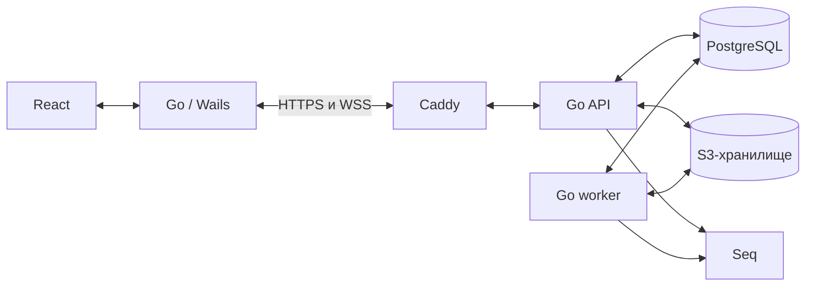

# План разработки корпоративного мессенджера

Статус: проект для обсуждения. Основание: [концепция](../readme.md). Дата: 09.09.2026.
Концепция задаёт желаемые возможности продукта; приведённые ниже приоритеты, параметры и архитектура — предложения, а не уже согласованные требования.

## 1. Исходные предположения

Подтверждено пользователем: не более 100 сотрудников, отдельные учётные записи мессенджера. Заданные сроки и требования к хранению, резервированию и офлайн-работе не представлены; состав команды пока неизвестен.

До уточнения среды предполагаем одну организацию, собственный Linux-сервер, локальную сеть/VPN и Windows 10/11 x64. Начальный нагрузочный профиль: 100 одновременных подключений при одном устройстве на сотрудника; несколько устройств потребуют увеличения числа соединений. ОС и способ сетевого доступа пока не согласованы.

Мобильные клиенты, звонки, видеоконференции, внешняя федерация и боты не входят в первоначальный объём. Поддержка дополнительных ОС определяется после инвентаризации рабочих мест. Веб-клиент можно добавить позднее, но он потребует отдельной реализации авторизации и проверки браузерных сценариев.

## 2. Предлагаемый стек

| Область | Решение | Назначение и условия |
|---|---|---|
| Десктоп | Wails + Go | Окно приложения, системный трей, файлы, уведомления, хранение сессии и сетевой клиент |
| Интерфейс | React + TypeScript + Vite | Типизированные компоненты, сборка интерфейса |
| Дизайн | CSS Modules + собственные дизайн-токены | Единые размеры, цвета, состояния и типографика; сложные доступные компоненты выбирать на прототипе |
| Сервер | Go, стандартный HTTP-стек | Модульный монолит с REST API и WebSocket |
| Контракты | OpenAPI для HTTP + описанные схемы событий | Версионирование API, единые ошибки, генерация клиента при необходимости |
| Данные | PostgreSQL, pgx, SQL-миграции | Переписка, права, уведомления, задания и аудит |
| Поиск | PostgreSQL Full Text Search | Поиск по тексту сообщений; имена и названия — отдельные индексы и запросы |
| Вложения | S3-совместимое хранилище | Закрытые объекты; конкретный продукт выбрать до реализации файлов |
| Логи | Go slog → структурированные события → Seq | Проверить доставку, буферизацию и лицензию на техническом прототипе |
| Входящий трафик | Caddy | HTTPS, проксирование API и WebSocket |
| Развёртывание | Docker Compose на Linux | Воспроизводимая установка для пилота и небольшой организации |
| Проверки | Go tests, React component tests, интеграционные и desktop smoke-тесты | Права, доставка, восстановление соединения, установка и обновление |

Версии Go, Node.js, React, PostgreSQL и образов фиксировать перед началом реализации с учётом поддержки и совместимости; не использовать плавающий `latest` в поставке.

### Уточнения по исходному стеку

- **Wails:** официальная документация сейчас называет v2 стабильной версией, а v3 — beta. Для пилота исходный вариант — v2; в этапе 0 проверить трей, уведомления и установку, затем окончательно выбрать ветку. Для Windows нужен WebView2, включая сценарий установки без интернета. [Статус Wails](https://v3.wails.io/faq/), [зависимости](https://wails.io/docs/gettingstarted/installation/).
- **MinIO:** публичный репозиторий архивирован 25 апреля 2026 года и помечен как неподдерживаемый. Поэтому новый production-проект не следует автоматически привязывать к этой редакции. Сохранить S3-интерфейс и выбрать поддерживаемое решение после проверки условий эксплуатации и лицензирования; AIStor указан самим проектом среди альтернатив. [Репозиторий MinIO](https://github.com/minio/minio).
- **Seq:** оставить при подходящей лицензии. Individual разрешает доступ к интерфейсу одному человеку; если журналами пользуются несколько специалистов, нужен многопользовательский план. Это число операторов Seq, а не сотрудников мессенджера. [Условия Seq](https://datalust.co/pricing).
- **PostgreSQL:** встроенный полнотекстовый поиск подходит для первой версии; качество русскоязычного поиска проверить на реальных примерах. Поиск внутри PDF/DOCX и OCR — отдельная будущая задача. [Документация поиска](https://www.postgresql.org/docs/current/textsearch.html).
- **Caddy:** для внутреннего адреса заранее определить источник сертификата и доставку доверенного корневого сертификата на рабочие места. Автоматический HTTPS не отменяет настройку доверия клиентов. [Документация HTTPS](https://caddyserver.com/docs/automatic-https).

## 3. Архитектура и границы ответственности



React отвечает за отображение и взаимодействие. Go-часть клиента отвечает за соединение, сессию, повторные попытки и интеграцию с ОС. Сервер единолично проверяет права и определяет итоговое состояние. Клиенты не имеют прямого доступа к PostgreSQL и административным ключам хранилища.

Один репозиторий, один серверный код с модулями: identity, conversations, messages, files, notifications, announcements, search, administration. Фоновые задачи используют тот же код и БД; вначале worker может запускаться внутри серверного процесса. Микросервисы, брокер сообщений и Redis для пилота не обязательны. При нескольких API-репликах потребуется отдельно решить межпроцессную рассылку и общий presence.

Предлагаемая структура: `cmd/server`, `cmd/desktop`, `internal/`, `frontend/`, `api/`, `migrations/`, `deploy/`, `docs/`. Серверную бизнес-логику не связывать с Wails.

## 4. Надёжность обмена сообщениями

1. Клиент отправляет команду через HTTP с уникальным идентификатором операции.
2. Сервер в одной транзакции проверяет доступ, сохраняет сообщение и событие в outbox.
3. Только после фиксации транзакции клиент показывает «Отправлено». Повтор команды возвращает существующий результат и не создаёт дубль.
4. Worker доставляет событие подключённым клиентам по WebSocket. Повторная доставка допустима, клиент устраняет дубли по идентификаторам.
5. После разрыва клиент получает пропущенные события по курсору. Если курсор устарел — обновляет доступные диалоги и историю. Права повторно проверяются при синхронизации.

Порядок сообщений задаёт сервер, а не часы рабочих компьютеров. Редактирование, удаление и изменение членства также входят в синхронизацию. События авторизации имеют приоритет: исключённый участник перестаёт получать новые сообщения и скачивать вложения.

Хранить позицию прочтения пользователя в диалоге; «отправлено», «прочитано» и «ознакомился с объявлением» — разные состояния. В MVP не показывать отдельный статус доставки на каждое устройство.

По умолчанию без сети доступны текущий экран и черновики в пределах сессии; приложение явно показывает отсутствие соединения. Полноценный локальный архив и отправка после перезапуска требуют отдельного решения о локальном хранилище, шифровании и очистке. Не обещать офлайн-доступ до его согласования.

## 5. Модель данных и продуктовые правила

Основные сущности: пользователи, подразделения, группы упоминаний, сессии, диалоги/каналы, участники, сообщения, вложения, реакции, позиции прочтения, события активности, подтверждения объявлений, закрепления, закладки, напоминания, опросы, аудит, outbox и фоновые задания.

- Личные диалоги, групповые чаты и каналы могут использовать общую техническую сущность conversation, но отображаются раздельно. В канале отдельно задаются права чтения и публикации.
- Роли организации: сотрудник, руководитель, администратор. Права канала: участник, автор, модератор/владелец. Руководитель не получает автоматически доступ к чужим личным сообщениям; администрирование также не должно неявно открывать всю переписку.
- Сервер проверяет доступ и для поиска, и для файлов, и для веток. Упоминание человека или группы не предоставляет доступ к закрытому каналу.
- В MVP «Ответить» вставляет ссылку с цитатой. Полноценные ветки добавляются позднее; структура сообщения заранее предусматривает ссылку на родителя и корень обсуждения.
- Для обязательного ознакомления фиксируются версия объявления и список адресатов на момент публикации. Существенное изменение создаёт новую версию и новые подтверждения. Реакция ✅ не считается ознакомлением.
- Закрепление и личная закладка по умолчанию не продлевают жизнь файла. После удаления вложения показывается «Срок хранения файла истёк». Постоянные инструкции требуют отдельной политики хранения.
- Архивирование запрещает новые сообщения и сохраняет чтение/поиск в пределах прав и срока хранения.
- DND по умолчанию подавляет звук и всплывающие уведомления, но сохраняет события в центре активности. Обход DND критическими объявлениями требует отдельного согласованного права.
- Статус «В сети» означает активное соединение, а не подтверждение присутствия человека за компьютером. Для нескольких устройств статус агрегируется.

## 6. Дизайн приложения

Основной принцип: повседневные действия видимы, редкие доступны через меню. Интерфейс русскоязычный, спокойный, с крупным текстом и минимумом декоративных элементов.

```text
┌─────────────────────────────────────────────────────────────────────┐
│ Поиск сообщений, сотрудников и каналов              Профиль / статус │
├──────────────────┬──────────────────────────────────────────────────┤
│ Важные        2  │ Бухгалтерия                      Участники / ⋯   │
│ Активность    5  │ Закреплённое сообщение                           │
│                  ├──────────────────────────────────────────────────┤
│ Личные           │ Имя Фамилия · время                              │
│  Анна Петрова    │ Текст сообщения                                  │
│                  │ Ответить                         Реакция / ⋯     │
│ Групповые чаты   │                                                  │
│ Каналы           │ Новые сообщения                                  │
│  Бухгалтерия     ├──────────────────────────────────────────────────┤
│  ИТ-служба       │ Написать сообщение…                              │
│ Сохранённое      │ Прикрепить файл                       Отправить  │
└──────────────────┴──────────────────────────────────────────────────┘
```

Правая панель появляется только при открытии ветки, участников или подробностей; постоянную третью колонку не использовать. На узком окне список диалогов сворачивается с понятной кнопкой возврата.

Предложения для дизайн-системы:

- светлая тема первой, нейтральные фоны и один акцентный цвет;
- основной текст 16 px, масштаб интерфейса 100–150%, основные кнопки высотой около 40–44 px;
- контраст обычного текста целевым образом не ниже 4,5:1; статус обозначается также текстом/значком;
- видимый фокус, управление клавиатурой и проверка экранного диктора на целевой ОС;
- Enter отправляет, Shift+Enter переносит строку; подсказка рядом с полем и возможность изменить настройку;
- понятные состояния: загрузка, пустой список, нет связи, повторить отправку, нет доступа, файл удалён;
- уведомления по умолчанию: личные сообщения, упоминания, важные объявления; обычные каналы без звука;
- настройки пользователя: уведомления, масштаб, запуск вместе с ОС. Администрирование — отдельный раздел с серверной проверкой доступа.

На прототипе проверить пять задач с 5–8 сотрудниками разного опыта: найти коллегу, написать, прикрепить документ, ответить, подтвердить объявление. Предварительный критерий: минимум 80% участников выполняют каждую задачу без подсказки.

## 7. Объём версий

| Версия | Возможности |
|---|---|
| MVP / пилот | Вход и управление пользователями, личные и групповые чаты, каналы подразделений, канал объявлений, подтверждение ознакомления, текст и файлы, ответ с цитатой, личные @упоминания, непрочитанное, базовые уведомления и DND, редактирование/удаление, простой поиск, закрепления, роли, аудит, срок хранения файлов, установка и восстановление из копии |
| 1.0 | Ветки, центр активности, реакции, групповые и ограниченные массовые упоминания, полный набор статусов, настройки каналов, архивирование, личные закладки, расширенные фильтры поиска, управляемое обновление клиента |
| 1.1 | Напоминания, опросы, автоматическая синхронизация групп с подразделениями, расширенные политики хранения сообщений |

AD/SSO и синхронизация с внешним каталогом не входят в согласованный вариант входа; возможны как последующее расширение. Если сроки ограничены, первыми кандидатами на перенос будут групповые чаты и закрепления; подтверждение объявлений стоит сохранить как важную рабочую функцию. Изменение объёма согласуется отдельно.

## 8. Этапы и критерии завершения

Оценка ниже предполагает двух разработчиков на полной занятости, участие администратора и доступ к пользователям. Это предварительные календарные диапазоны, не обязательство по срокам; неизвестная инфраструктура и интеграции могут их увеличить.

| Этап | Срок | Результат и критерий готовности |
|---|---|---|
| 0. Требования и технические пробы | 1–2 недели | Профиль нагрузки, ОС, вход, хранение и лицензии определены; Wails устанавливается на типовой ПК, работает трей/уведомление, HTTPS/WSS проходит через сеть организации |
| 1. UX и контракты | 1–2 недели | Проверены основные экраны; согласованы правила объявлений, прав и удаления; описаны API, события и схема данных |
| 2. Основа системы | 2–3 недели | Репозиторий, CI, миграции, вход, роли, аудит, конфигурация, тестовый сервер и установщик |
| 3. Вертикальный сценарий общения | 3–4 недели | Два реальных клиента обмениваются сообщениями; проверены повторы, разрыв сети, перезапуск сервера, непрочитанное и ограничения доступа |
| 4. Рабочий MVP | 3–4 недели | Файлы, объявления с подтверждением, поиск, @упоминания, DND, редактирование/удаление, хранение и интерфейс администрирования |
| 5. Пилот и эксплуатация | 2–3 недели | 20–30 сотрудников работают в системе; пройдены нагрузка, восстановление копии и установка обновления; исправлены критические дефекты |
| 6. Версия 1.0 | 4–6 недель | Реализованы функции 1.0 и устранены проблемы пилота; подготовлены инструкции пользователя и администратора |
| 7. Версия 1.1 | После оценки пилота | Напоминания, опросы и расширения по фактическому спросу |

При последовательном выполнении: ориентир до завершения пилота 12–18 недель, до 1.0 — 16–24 недели. Для одного разработчика нужна отдельная оценка; эти сроки на него не переносить.

## 9. Начальные технические параметры

Все значения — стартовые предложения для согласования и измерений.

| Параметр | Предложение |
|---|---|
| Нагрузочный профиль | 100 одновременных соединений, 10 сообщений/с длительно, краткий пик 50 сообщений/с, отдельный тест массового объявления |
| Подтверждение сохранения | p95 ≤ 500 мс в локальной сети при согласованной нагрузке |
| Появление у подключённого адресата | p95 ≤ 1 с от отправки |
| Поиск | p95 ≤ 2 с на тестовой базе 1 млн сообщений с проверкой прав |
| Вложения | До 50 МБ на файл, до 10 вложений на сообщение; потоковая передача |
| Хранение | Для файлов предварительно 90 дней; автоудаление сообщений выключено до решения владельца данных |
| Пилотный сервер | Начальная конфигурация 4 vCPU / 8 ГБ RAM + SSD; измерить конкуренцию PostgreSQL, хранилища и Seq, при необходимости увеличить/разнести |
| Восстановление | Предлагаемые RPO ≤ 24 ч и RTO ≤ 4 ч; подтвердить учебным восстановлением |
| Доступность | Рабочее время с согласованными окнами обслуживания; круглосуточный SLA отдельно |

Диск считать по фактическому потоку: объём файлов в сутки × срок хранения + БД/индексы + логи + запас. Например, 2 ГБ файлов/сутки × 90 дней = 180 ГБ только активных вложений. Копии, версии объектов и запас учитываются дополнительно; объём SSD нельзя выводить лишь из количества сотрудников.

## 10. Безопасность, файлы и эксплуатация

Авторизация: отдельные локальные учётные записи, создаваемые администратором, без публичной регистрации. Предусмотреть безопасное хеширование паролей, ограничение попыток входа, временный пароль со сменой при первом входе и административный сброс пароля. Сессии отзываются при блокировке пользователя и сбросе пароля; секреты клиента хранятся средствами ОС, не в localStorage. AD/LDAP/SSO для первоначальной версии не требуется.

TLS обязателен. Шифрование дисков и копий определяется средой развёртывания. Базовая архитектура предполагает, что сервер может обрабатывать текст ради поиска и хранения; сквозное шифрование потребует другого проектирования и отдельного решения.

Файлы загружаются через API потоково в закрытое хранилище. API проверяет размер, тип и право участия; имя объекта генерируется сервером. Антивирусная проверка — отдельная интеграция, её необходимость и средство определить до пилота. Если включена проверка, файл недоступен до её завершения. Скачать файл можно только после актуальной проверки прав. Метаданные в PostgreSQL и объект связываются через состояния загрузки; фоновая сверка убирает незавершённые загрузки и повторяет неудачные удаления.

Истечение срока сначала запрещает скачивание, затем worker удаляет объект, миниатюры и связанные копии в рабочем хранилище. Политика отдельно учитывает версии объектов, резервные копии и локальные кэши. После восстановления копии повторно применяются удаления и сроки. Уже скачанные пользователем документы сервер отозвать не может.

Аудит хранится отдельно от диагностических логов: кто, когда, что изменил, над каким объектом и с каким результатом. Важное изменение и запись аудита фиксируются одной транзакцией. Приложение не предоставляет редактирование аудита; это не защита от администратора самой БД. Тексты сообщений, файлы, пароли и токены в Seq не отправляются.

Мониторинг должен показывать доступность, ошибки API, задержки сообщений, отставание outbox, неуспешные удаления, место на диске и результат резервного копирования. Недоступность Seq не блокирует отправку сообщений; буфер логов ограничен.

До пилота нужны: отдельные тестовая и рабочая среды, копии БД и объектов вне основного сервера, учёт секретов и сертификатов, проверка восстановления, инструкция установки и отката. Один сервер — единая точка отказа; резервные копии не обеспечивают непрерывность работы.

Установщик должен учитывать обычного пользователя без прав администратора и развёртывание силами ИТ-службы. Подписанные пакеты и управляемый канал обновлений предусмотреть до массового внедрения. Приложение должно корректно сообщать о несовместимом сервере; миграции и обновления проверять на предыдущей поддерживаемой версии клиента.

## 11. Проверки готовности к пилоту

- Повтор отправки после потери ответа не создаёт дубль; сообщения после сбоя сервера доступны после подключения.
- Пользователь не получает чужой закрытый канал через API, поиск, WebSocket, упоминания или скачивание файла.
- Блокировка учётной записи и исключение из канала отзывают дальнейший доступ.
- Ознакомление привязано к нужной версии и конкретному адресату; отчёт отличает неподтвердивших сотрудников.
- Файл с истёкшим сроком недоступен даже при отставании физического удаления.
- DND, непрочитанное и черновики ведут себя предсказуемо при обрыве соединения.
- Бэкап восстановлен на чистой среде; проверены сообщения, файлы, права и фактический RTO.
- Установщик и уведомления проверены на типовых рабочих ПК; интерфейс проверен на разных масштабах экрана.

## 12. Открытые решения

1. При подтверждённых ≤100 сотрудниках: число устройств на человека, версии ОС и минимальные характеристики ПК.
2. Локальная сеть, VPN или доступ из интернета; доступность сервера во внерабочее время.
3. Для выбранных отдельных учётных записей: ответственный за создание, сброс пароля и блокировку пользователей.
4. Команда, срок пилота, бюджет инфраструктуры и допустимость платных лицензий.
5. Сроки хранения сообщений, файлов, аудита и копий; необходимость постоянных вложений в объявлениях.
6. Требуемые RPO/RTO, допустимость единого сервера, ответственный за сопровождение.
7. Необходимость офлайн-истории, нескольких устройств и локального хранения конфиденциальных данных.
8. Правила доступа администрации к переписке, удаления сообщений и обхода DND.

Следующий результат после ответов — согласованная спецификация MVP, решения по архитектуре и backlog с критериями приёмки для каждой задачи.
