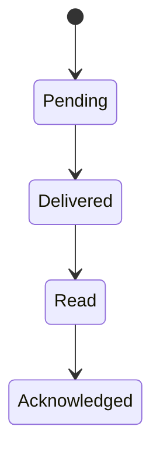

# Доменная модель и черновой API

Документ определяет семантику целевого MVP. Конкретная OpenAPI-схема и сгенерированные типы появятся на этапе функционального MVP. До этого контракт имеет статус чернового.

## 1. Общие правила

- Базовый путь REST: `/api/v1`.
- Формат тела и ошибок: JSON UTF-8; время — UTC в RFC 3339.
- Идентификаторы — непрозрачные UUID и не несут бизнес-смысла.
- Авторизация — `Authorization: Bearer <access-token>`.
- Создающие и отправляющие команды требуют `Idempotency-Key`, созданный клиентом и стабильный при повторе.
- Списки используют cursor pagination: `limit` и `cursor`; offset pagination не применяется к истории сообщений и событий.
- Ошибка имеет форму `{"error":{"code":"...","message":"...","details":{}}}`. `message` безопасно показывать пользователю, `code` стабилен для клиентской логики.

## 2. Сущности

### User

`id`, `login`, `displayName`, `position`, `departmentId`, `status`, `blockedAt`, `createdAt`, `updatedAt`.

Логин уникален без учета регистра. Блокировка немедленно запрещает новые операции и отзывает активные сессии.

### Department, Group и Tag

- `Department`: иерархический узел с `parentId`, названием, руководителем и служебным `conversationId`.
- `Group`: управляемая выборка пользователей, не обязательно совпадающая с оргструктурой.
- `Tag`: уникальная административная метка для выбора аудитории и разрешенных массовых упоминаний.

Членство изменяется только административной командой. Изменение подразделения атомарно обновляет доступ к служебным чатам.

### Role, Permission и Scope

Назначение роли связывает `userId`, предопределенную роль, набор дополнительных разрешений и область: организация, список подразделений либо список групп. Эффективное право вычисляется сервером на каждый запрос; UI только скрывает недоступные действия для удобства.

### Conversation и Membership

Типы `Conversation`: `direct`, `public_channel`, `private_channel`, `department_channel`.

Общие поля: `id`, `type`, `name`, `description`, `createdBy`, `archivedAt`, `createdAt`, `updatedAt`. Для direct-чата пара пользователей уникальна. `Membership` хранит пользователя, роль в чате, момент вступления, последний прочитанный sequence и режим обычных уведомлений: `all`, `mentions` или `muted`.

### Message

Поля: `id`, `conversationId`, `authorId`, `kind`, `text`, `replyToId`, `clientCreatedAt`, `createdAt`, `editedAt`, `deletedAt`, `revokedAt`, `revocationReason`, `sequence`.

`kind`: `regular`, `critical`, `system`, `dnd_auto_reply`. Вложения и упоминания связаны отдельными записями. Текст после мягкого удаления недоступен обычному API. Критичное сообщение неизменяемо после создания.

### Attachment

Поля: `id`, `ownerId`, `originalName`, `mediaType`, `size`, `sha256`, `state`, `storageKey`, `createdAt`, `attachedAt`, `expiresAt`, `purgedAt`.

Состояния: `uploading`, `ready`, `attached`, `expired`, `deleted`. Для прикрепленного файла `expiresAt` равен времени отправки сообщения или объявления плюс 30 дней. После перехода в `expired` содержимое и `storageKey` физически удаляются, а имя, тип, размер, checksum и связь с исходным объектом сохраняются. Доступ к скачиванию всегда вычисляется через связанное сообщение или объявление; прямой storage path клиенту не возвращается.

Общая политика вложений содержит `maxFileSize`, `storageQuota`, `warningThreshold = 0.70` и `rejectThreshold = 0.95`. При достижении порога запрета создание новой загрузки возвращает `attachment_storage_full`; уже загруженные файлы и текстовые команды остаются доступны.

### Announcement

Поля: `id`, `authorId`, `title`, `text`, `critical`, `status`, `audienceSpec`, `audienceCount`, `createdAt`, `sentAt`, `revokedAt`, `revocationReason`.

`audienceSpec` сохраняет исходные критерии, а `AnnouncementRecipient` — дедуплицированный снимок адресатов на момент отправки. Последующие изменения тегов или подразделений не меняют уже отправленную аудиторию.

### Receipt

Ключ — тип объекта и пара `objectId + recipientId`. Времена `deliveredAt`, `readAt`, `acknowledgedAt` монотонны: подтверждение подразумевает просмотр, просмотр подразумевает доставку. Повторная команда не меняет первое зафиксированное время.



### Presence

Поля: `userId`, `mode`, `statusText`, `expiresAt`, `lastActivityAt`, `dndSessionId`, `autoReplyText`, `updatedAt`. `mode`: `working`, `away`, `dnd`, `offline`.

Presence — оперативное состояние и не является доказательством фактического нахождения сотрудника за компьютером.

### Retention и AuditEvent

Тексты сообщений и объявлений хранятся бессрочно, включая скрытый текст мягко удаленных объектов. Содержимое вложений удаляется через 30 дней после отправки независимо от типа чата и области действия. Срок не настраивается администратором.

`AuditEvent` хранит актера, действие, тип и идентификатор объекта, результат, время, correlation ID и безопасные метаданные. Текст сообщений не копируется в аудит.

## 3. Ключевые инварианты

1. Сервер проверяет членство и scope до чтения объекта и до публикации любого события.
2. Критичное сообщение или отправленное объявление нельзя редактировать; отзыв сохраняет объект и квитанции.
3. Аудитория объявления является неизменяемым снимком после отправки.
4. Один idempotency key в пределах пользователя и операции соответствует одному результату и одному hash входных данных.
5. Повторное использование ключа с другим телом возвращает `409 idempotency_conflict`.
6. Состояния квитанций движутся только вперед.
7. Автоответ создается не более одного раза для пары «DND-сессия + отправитель» и сам не инициирует автоответ.
8. Системное время клиента не определяет порядок сообщений, сроки или права.
9. Удаление доступа порождает событие очистки кеша и запрещает дальнейшую загрузку вложений.

## 4. REST-ресурсы

### Аутентификация

| Метод и путь | Назначение |
| --- | --- |
| `POST /auth/login` | Логин/пароль, выдача access token на 15 минут и refresh token на 30 дней |
| `POST /auth/refresh` | Однократная ротация refresh token без продления исходного 30-дневного срока сессии |
| `POST /auth/logout` | Отзыв текущей сессии |
| `POST /auth/change-password` | Замена временного или постоянного пароля; ограниченная сессия первого входа допускает только эту операцию |
| `POST /auth/ws-ticket` | Короткоживущий одноразовый ticket для открытия WebSocket |
| `GET /me` | Текущий пользователь, роли, scope и настройки |

### Оргструктура и администрирование

| Метод и путь | Назначение |
| --- | --- |
| `GET/POST /users` | Список и создание пользователей; при создании временный пароль возвращается один раз вместе с `expiresAt` |
| `PATCH /users/{id}` | Профиль, блокировка и подразделение |
| `POST /users/{id}/reset-password` | Аннулирование прежних сессий и временного пароля; новый временный пароль возвращается один раз вместе с `expiresAt` |
| `GET/POST/PATCH /departments` | Дерево подразделений |
| `GET/POST/PATCH /groups` | Служебные группы и членство |
| `GET/POST/PATCH /tags` | Теги и членство |
| `GET/POST/DELETE /role-assignments` | Назначения ролей и scope |
| `GET /audit-events` | Фильтрованный административный аудит с пагинацией |
| `POST /audit-events/export` | Формирование одного CSV-файла по фильтрам; требует `audit.export` и создает событие аудита |

### Чаты и сообщения

| Метод и путь | Назначение |
| --- | --- |
| `GET/POST /conversations` | Доступные чаты и создание канала/диалога |
| `PATCH /conversations/{id}/notification-settings` | Персональный режим обычных уведомлений текущего пользователя |
| `GET /conversations/{id}/messages` | История назад от cursor |
| `POST /conversations/{id}/messages` | Отправка сообщения |
| `POST /conversations/{id}/mention-preview` | Проверка разрешения/scope и расчет дедуплицированных адресатов `@tag` с выдачей короткоживущего preview token |
| `PATCH /messages/{id}` | Редактирование обычного сообщения |
| `DELETE /messages/{id}` | Мягкое удаление обычного сообщения |
| `POST /messages/{id}/revoke` | Отзыв критичного сообщения с причиной |
| `POST/DELETE /messages/{id}/reactions/{emoji}` | Реакция текущего пользователя |
| `POST/DELETE /messages/{id}/pin` | Закрепление и открепление |
| `POST /messages/{id}/read` | Фиксация просмотра |
| `POST /messages/{id}/acknowledge` | Явное «Ознакомлен» |
| `POST /receipts/delivered` | Пакетная фиксация доставки объектов клиенту |
| `GET /search/messages` | PostgreSQL FTS `russian` по доступным сообщениям и объявлениям |
| `GET /search/directory` | Регистронезависимая точная подстрока по доступным именам и логинам |
| `GET /attention` | Упоминания и доступные объекты, требующие ознакомления |

Раздел «Внимание» является вычисляемым представлением исходных сообщений и объявлений. Он не создает отдельные копии контента и на каждый запрос применяет текущие права пользователя.

Сообщение с `@tag` включает preview token. Сервер непосредственно перед созданием сообщения заново рассчитывает дедуплицированный набор доступных адресатов. Если hash состава отличается от preview, команда возвращает `audience_changed`; фиксированного ограничения количества адресатов нет.

Поиск текста использует нормализованный `tsvector` с явно заданной конфигурацией `pg_catalog.russian`. Имена пользователей, логины и исходные имена файлов сопоставляются с регистронезависимой подстрокой. Метаданные вложения остаются в индексе после удаления его содержимого по сроку. OCR, содержимое файлов, нечеткое сопоставление и словарь синонимов не входят в MVP.

### Объявления и вложения

| Метод и путь | Назначение |
| --- | --- |
| `POST /announcements/preview` | Проверка прав и дедуплицированная аудитория без отправки |
| `POST /announcements` | Отправка по ранее подтвержденной спецификации |
| `GET /announcements` | Доступные входящие и отправленные объявления |
| `GET /announcements/{id}/stats` | Агрегаты и разрешенные списки квитанций |
| `POST /announcements/{id}/read` | Фиксация просмотра объявления |
| `POST /announcements/{id}/acknowledge` | Явное подтверждение критичного объявления |
| `POST /announcements/{id}/revoke` | Отзыв с причиной |
| `POST /attachments` | Потоковая загрузка одного файла |
| `GET /attachments/{id}` | Авторизованное скачивание |

Preview возвращает краткоживущий `previewToken`, hash нормализованной аудитории и итоговое количество. Отправка принимает token; при изменении аудитории или истечении token требует новый preview.

### Синхронизация и присутствие

| Метод и путь | Назначение |
| --- | --- |
| `GET /sync?after={sequence}` | Восстановление долговечных событий после курсора |
| `PUT /presence` | Ручной статус, DND, срок и автоответ |
| `POST /conversations/{id}/typing` | Эфемерный typing-сигнал |

## 5. WebSocket-контракт

Подключение: `WSS /api/v1/events?after=<sequence>`. Аутентификация передается одноразовым ticket, предварительно полученным по HTTPS; bearer token не помещается в URL.

Базовый envelope:

```json
{
  "eventId": "uuid",
  "sequence": 10428,
  "type": "message.created",
  "occurredAt": "2026-07-24T08:30:00Z",
  "resourceId": "uuid",
  "payload": {}
}
```

Долговечные типы событий:

- `message.created`, `message.updated`, `message.deleted`, `message.revoked`;
- `reaction.changed`, `pin.changed`;
- `receipt.changed`;
- `announcement.created`, `announcement.revoked`;
- `conversation.changed`, `membership.changed`, `access.revoked`;
- `user.changed`, `policy.changed`.

Эфемерные события без `sequence`: `presence.changed`, `typing.started`, `typing.stopped`. Потеря такого события допустима; у него есть короткий TTL.

Долговечные события хранятся 30 дней с момента создания. Клиент подтверждает последний примененный sequence. Если соответствующий курсор неизвестен или старше доступного журнала, сервер отвечает `resync_required`, после чего клиент очищает производный кеш и выполняет полную синхронизацию всех доступных ему данных.

## 6. Коды ошибок

Минимальный стабильный набор: `invalid_credentials`, `session_revoked`, `forbidden`, `not_found`, `validation_failed`, `edit_window_expired`, `immutable_message`, `attachment_too_large`, `attachment_storage_full`, `idempotency_conflict`, `preview_expired`, `audience_changed`, `rate_limited`, `resync_required`, `server_version_incompatible`.

`403` и `404` выбираются так, чтобы не раскрывать существование приватного ресурса. Детальная причина отказа записывается в серверный аудит, но не возвращается неавторизованному пользователю.
