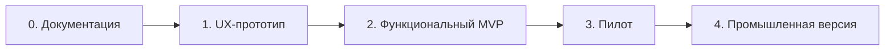

# План развития

Этапы следуют друг за другом через приемочные ворота. Новый этап может начаться исследовательски, но предыдущий считается закрытым только после выполнения своего Definition of Done.

## Этап 0. Базовая документация

Результат:

- согласованные требования, UX и границы продукта;
- архитектура, доменная модель и черновой API;
- модель безопасности и эксплуатации;
- ADR и реестр открытых вопросов.

Definition of Done:

- документы связаны между собой и используют единый глоссарий;
- Mermaid-блоки синтаксически проверены;
- каждое незакрытое решение имеет этап, до которого его нужно принять;
- документация не утверждает готовность функций, которых еще нет.

## Этап 1. Desktop UX-прототип

Результат: Wails v2 + React/TypeScript-приложение для Windows 10/11 x64 и Ubuntu 22.04 x64 с детерминированными мок-данными и панелью сценариев.

Включает:

- трехпанельную компоновку, темную и светлую темы;
- личные, публичные, приватные и служебные чаты;
- сообщения, реакции, закрепления, упоминания, поиск и вложения;
- объявления, критичные квитанции, DND и автоответ;
- персональные настройки уведомлений и единый раздел «Внимание»;
- административные экраны и переключение ролей;
- имитацию офлайн-очереди и восстановления.

Не включает реальный сервер, криптографию, надежную локальную БД и фактическую межклиентскую доставку.

Definition of Done: выполнены десять сценариев из [UX-спецификации](ux-spec.md#11-приемка-ux-прототипа), сборки запускаются на обеих ОС, критические UX-замечания занесены в требования.

## Этап 2. Функциональный MVP

Результат: одна тестовая on-premise-инсталляция с реальными учетными записями, сервером, PostgreSQL, вложениями и desktop-клиентом.

Последовательность реализации:

1. Identity, оргструктура, RBAC и базовое администрирование.
2. Личные/групповые чаты, REST-команды, WebSocket и SQLite-кеш.
3. Идемпотентность, reconnect, офлайн-очередь и отзыв доступа.
4. Вложения, поиск, реакции, закрепления и редактирование.
5. Объявления, критичные квитанции, напоминания, присутствие, DND, настройки уведомлений и раздел «Внимание».
6. Retention, аудит, backup, launcher и автономная поставка.

Definition of Done:

- выполнены десять критериев из [требований](product-requirements.md#5-критерии-приемки-целевого-mvp);
- API зафиксирован OpenAPI и схемой WebSocket, сгенерированы клиентские типы;
- интеграционные тесты покрывают права, идемпотентность и синхронизацию;
- проверено восстановление резервной копии;
- нет незакрытых security-дефектов высокого риска.

## Этап 3. Ограниченный пилот

Результат: эксплуатация ограниченной группой сотрудников на реальных данных в отдельном организационном контуре.

До запуска обязательны:

- закрытие вопросов RPO/RTO, паролей, сертификатов, подписи клиента, хранения и доступности;
- нагрузочный тест на 500 пользователей/200 подключений с согласованным профилем сообщений;
- матрица совместимости Windows 10/11 и Ubuntu 22.04, включая WebView2/WebKitGTK;
- runbook обновления, отката, восстановления и реагирования;
- обучение администраторов и коммуникаторов.

Критерии выхода: стабильность и UX оценены на согласованном периоде, исправлены блокирующие дефекты, подтверждены фактические требования к ресурсам и поддержке.

## Этап 4. Промышленная версия

Результат: утвержденная on-premise-поставка для всей организации.

Включает эксплуатационные SLA/SLO, регулярные тесты восстановления, контролируемое управление релизами, мониторинг, проверенную политику хранения, security review и план обновления зависимостей Wails/WebView/Go/PostgreSQL.

Антивирусная проверка вложений, высокая доступность, дополнительные Linux-дистрибутивы, E2EE, треды, интеграции и другие клиенты рассматриваются только отдельными изменениями требований и ADR.

## Сквозная стратегия тестирования

| Уровень | Основная цель |
| --- | --- |
| Unit | Доменные инварианты, аудитории, scope, состояния квитанций |
| Component | Модули сервера с PostgreSQL и файловым volume |
| Contract | OpenAPI, WebSocket envelope и обратная совместимость клиента/сервера |
| Integration | TLS, PostgreSQL, загрузки, outbox, reconnect и backup/restore |
| Desktop E2E | Ключевые сценарии на Windows и Ubuntu |
| Security | Сессии, IDOR, scope, утечки логов, подпись релиза |
| Load | 500 пользователей, 200 WebSocket и профиль массовой рассылки |
| Operations | Offline install, update, rollback, backup и disaster recovery |
