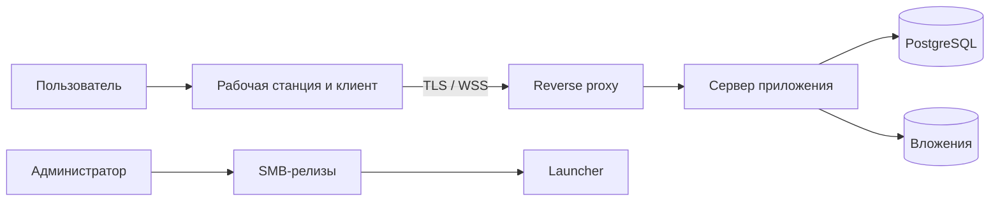

# Безопасность и эксплуатация

## 1. Модель доверия

Система работает внутри организации, но внутренняя сеть, SMB-ресурс и рабочая станция не считаются безусловно доверенными. Сервер остается единственной стороной, принимающей решения о правах.

Защищаемые активы:

- учетные данные и активные сессии;
- содержание сообщений и вложений;
- оргструктура, роли и области полномочий;
- квитанции критичных сообщений и аудит;
- релизные бинарники и серверная конфигурация;
- резервные копии и клиентские релизы.

Основные границы доверия:

## 2. Аутентификация и сессии

- Локальную учетную запись создает администратор. Пользователь при первом входе меняет временный пароль.
- Временный пароль генерируется сервером, показывается администратору только в ответе на создание учетной записи или сброс и не доступен для повторного просмотра. Он действует 24 часа и аннулируется после первого успешного входа; выданная при таком входе ограниченная сессия позволяет только задать постоянный пароль.
- Администратор передает временный пароль лично, по телефону либо через утвержденный внутренний канал, не зависящий от USZN Messenger. При подозрении на раскрытие администратор аннулирует пароль и выпускает новый.
- Пользовательский пароль содержит не менее 12 символов; сервер допускает длину не менее 64 символов и проверяет пароль по поставляемому в автономный контур denylist. Обязательные комбинации регистров, цифр и специальных символов не задаются.
- Срок действия пароля не ограничен. Смена обязательна при первом входе, после административного сброса и при признаках компрометации учетных данных.
- Пароли хешируются Argon2id с уникальной солью и параметрами, зафиксированными по результатам измерений на серверном оборудовании. Исходные пароли не логируются и не восстанавливаются.
- Access token действует 15 минут. Refresh token действует 30 дней с момента входа и ротируется при каждом использовании без продления исходного 30-дневного срока. Повтор старого refresh token отзывает всю связанную цепочку; после истечения срока пользователь повторно вводит пароль.
- Access token хранится только в памяти клиента. Refresh token хранится в защищенном хранилище учетных данных ОС; при его отсутствии постоянный вход отключается.
- Блокировка пользователя, административный сброс пароля и явный выход отзывают соответствующие сессии.
- Сервер ограничивает частоту входа по логину и источнику, применяет нарастающую задержку и создает security-событие при серии ошибок.

## 3. Авторизация

Проверка выполняется сервером в три шага:

1. Аутентифицирован ли пользователь и не заблокирован ли он.
2. Есть ли требуемое разрешение у базовой роли или дополнительного назначения.
3. Входит ли объект операции в область действия назначения.

Массовое упоминание административного тега требует разрешения `mention.tag` в соответствующем scope. Проверка preview не резервирует аудиторию: разрешение и фактический состав повторно проверяются при отправке.

Базовые группы разрешений:

| Группа | Примеры |
| --- | --- |
| `organization.manage` | Пользователи, подразделения, группы и теги |
| `roles.manage` | Роли, разрешения и scope |
| `channels.manage` | Создание и архивирование служебных/тематических каналов |
| `messages.moderate` | Закрепление и административный отзыв |
| `critical.send` | Критичное сообщение в разрешенной области |
| `announcements.send` | Предпросмотр и отправка разрешенной аудитории |
| `announcements.stats` | Списки и агрегаты квитанций |
| `audit.read` | Просмотр административного аудита |
| `policies.manage` | Хранение, лимиты и параметры продукта |

Изменение прав применяется к следующим запросам немедленно. Клиентское меню обновляется событием, но устаревший UI не дает возможности обойти серверную проверку.

## 4. Защита данных

- Внешний интерфейс сервера доступен только по HTTPS/WSS с сертификатом внутреннего CA. HTTP либо отключен, либо перенаправляется до обработки учетных данных.
- Публичный сертификат внутреннего CA включается в комплект клиента и загружается Go-ядром в отдельный набор доверенных корней только для USZN Messenger. Системные хранилища Windows и Ubuntu не изменяются; пользователь не может принять неизвестный сертификат или отключить проверку TLS.
- Закрытый ключ CA в клиент, релизный каталог и сервер приложения не включается; его хранение относится к защищенной инфраструктуре CA. На серверном хосте с минимальными правами находится только закрытый ключ действующего TLS-сертификата сервера.
- Ротация CA выполняется с перекрытием: клиент с доверенными старым и новым CA распространяется до переключения сертификата сервера. Аварийная ротация может потребовать ручного обновления клиента, если прежнему CA больше нельзя доверять.
- Сквозного шифрования нет: сервер обрабатывает текст для поиска, аудиторий, квитанций, резервирования и соблюдения сроков хранения.
- Шифрование PostgreSQL, volume вложений и резервных копий обеспечивается средствами ОС/хранилища. Ключи не размещаются рядом с копиями.
- SQLite-кеш приложения не шифруется самим продуктом и находится в профиле пользователя с минимальными правами. Требуется шифрование системного диска политикой организации.
- При отзыве сессии клиент удаляет токены. При отзыве доступа к ресурсу удаляются связанные записи и локальные копии вложений. Полная очистка профиля предоставляется отдельным действием «Удалить локальные данные».
- Секреты, токены, пароли и текст сообщений исключаются из технических логов и crash-отчетов.

## 5. Вложения

- Клиент и сервер независимо применяют текущий лимит; сервер является источником истины.
- Общую квоту volume задает эксплуатация. При заполнении 70% формируется предупреждение, при 95% новые загрузки отклоняются до освобождения места; текстовые функции, скачивание и фоновое удаление продолжают работать.
- Имя файла нормализуется для отображения и никогда не используется как storage path.
- MIME-тип клиента считается подсказкой, скачивание отдается как attachment с безопасным именем и заголовками.
- Доступ проверяется на каждом скачивании по текущему членству или снимку аудитории.
- Временные и непривязанные файлы удаляются плановой задачей.
- Встроенного антивирусного сканирования, карантина и запрета исполняемых форматов нет и для промышленной версии. Перед скачиванием клиент сообщает, что файл получен от другого пользователя и не проверен приложением.
- Это постоянный принятый риск: вредоносный файл может храниться на сервере и быть скачан участниками. Защита рабочих станций и серверного volume относится к инфраструктуре, но ее наличие не является техническим условием запуска USZN Messenger.

## 6. Аудит

Аудит хранит действия и метаданные, но не отдельную копию текста сообщений.

Обязательные события:

- успешный вход, неуспешные попытки, выход и отзыв сессии;
- создание, блокировка, восстановление и изменение пользователя;
- изменения подразделений, групп, тегов, ролей и scope;
- создание/архивирование канала и изменение членства;
- предпросмотр, отправка и отзыв объявления;
- отправка и отзыв критичного сообщения;
- административное удаление, изменение политик и лимитов;
- запуск восстановления из резервной копии и изменение релизного manifest.

Событие содержит время, актера, действие, тип/ID объекта, результат, correlation ID и безопасные diff-метаданные. Обычный пользовательский текст, пароль, токен и содержимое вложения не включаются. Доступ к журналу отделен разрешением `audit.read`, а выгрузка сама создает событие аудита.

Экспорт требует отдельного разрешения `audit.export` и формирует один CSV-файл в UTF-8. Доступны фильтры по периоду, актеру, действию, типу/ID объекта и результату. Колонки: время UTC, актер, действие, тип объекта, ID объекта, результат, correlation ID и безопасные метаданные. JSON, криптографическая подпись, текст сообщений и содержимое вложений в экспорт не входят.

## 7. Хранение и удаление

- Тексты сообщений и объявлений хранятся бессрочно во всех типах чатов. Мягкое удаление скрывает текст от пользовательского API, но не удаляет его из PostgreSQL.
- Содержимое каждого прикрепленного файла становится недоступно и физически удаляется через 30 дней после отправки сообщения или объявления. Срок одинаков для всех типов объектов и не настраивается администратором.
- Метаданные файла — исходное имя, тип, размер, checksum, автор и связь с объектом — сохраняются бессрочно. Клиент показывает вместо скачивания состояние «Срок хранения истек».
- Фоновая задача удаления работает пакетами и формирует метрики об ошибках и просроченных файлах. Legal hold и исключения для отдельных вложений не предусмотрены.

## 8. Резервное копирование и восстановление

Копия должна охватывать PostgreSQL, volume вложений, серверную конфигурацию без секретов, версию образов и публичные сертификаты. База и файлы должны относиться к согласованной точке либо иметь процедуру сверки после восстановления.

Резервное копирование выполняется один раз в сутки. Конкретное окно запуска выбирается эксплуатацией с учетом фактического размера данных и длительности операции. Целевые показатели: RPO 24 часа и RTO 4 часа. Хранятся только семь последних ежедневных копий; более старые копии удаляются после успешного создания и проверки новой.

Минимальная процедура создания копии:

1. Создать копию БД и вложений в изолированное хранилище.
2. Сформировать manifest с составом, временем, версиями и checksum.
3. В рамках той же операции автоматически проверить checksum, читаемость всех частей и согласованность manifest.
4. При ошибке считать создание копии неуспешным и сформировать инцидент мониторинга.
5. Зафиксировать длительность, объем и результат проверки в операционном журнале.

Проверка при создании подтверждает целостность копии, но не доказывает достижимость RTO. Полное учебное восстановление по регулярному расписанию не требуется принятым решением и остается эксплуатационным риском. Ответственный за процедуру восстановления назначается до промышленного запуска.

Удаленное по сроку содержимое вложения может оставаться внутри резервной копии не более семи дополнительных суток. Копии недоступны пользователям и не используются для выборочного возврата файлов. После полного восстановления задача retention выполняется до открытия пользовательского доступа и повторно удаляет вложения старше 30 дней.

## 9. Автономная поставка сервера

- Комплект включает versioned OCI-образы, Compose-файл, миграции, SBOM, checksum и инструкции отката.
- Образы собираются вне изолированного контура, проверяются и переносятся утвержденным способом.
- Миграция БД выполняется отдельной контролируемой командой перед переключением приложения и должна иметь проверку совместимости.
- Конфигурация передается через файлы/секреты хоста; значения по умолчанию не содержат production-паролей.
- Reverse proxy завершает TLS, ограничивает размер запросов и задает безопасные таймауты для WebSocket и загрузок.

## 10. Launcher и клиентские релизы

- Launcher читает manifest с SMB и после копирования сверяет SHA-256 клиентского файла.
- Копирование выполняется во временный локальный каталог; активация версии — атомарным переименованием после проверки.
- При недоступности SMB или поврежденном новом релизе запускается последняя локальная проверенная совместимая версия.
- Хранятся текущая и предыдущая версии. Автоматическое удаление не затрагивает запущенный процесс.
- Manifest может запретить слишком старую версию клиента при несовместимом серверном контракте.
- Windows-релиз не содержит WebView2 и использует runtime из базового образа ОС. Linux-релиз требует GTK3 и WebKit2GTK ABI 4.1; launcher проверяет наличие зависимостей и выдает диагностическую ошибку до запуска клиента.
- Launcher, manifest и клиентские бинарники не подписываются. SHA-256 выявляет повреждение при копировании, но не защищает от умышленной одновременной подмены manifest, бинарника или самого launcher на SMB.
- Риск подмены принимается. Запись в релизный каталог ограничивается выделенной административной группой средствами файлового сервера; изменения каталога журналируются инфраструктурой.
- Поскольку клиент не подписан, злоумышленник с правом изменения релиза может заменить и встроенный CA. Это входит в принятый ADR-0006 риск компрометации SMB.

## 11. Мониторинг и реагирование

Для внутреннего мониторинга публикуются health/readiness и аутентифицированные метрики. Проверяются доступность API, PostgreSQL и volume, задержка outbox, число WebSocket, частота ошибок, использование квоты вложений, свободное место и возраст backup.

События уровня инцидента: массовые ошибки входа, повреждение вложений, отставание outbox, заполнение диска, неуспешная копия, несоответствие checksum релиза, несанкционированное изменение релизного каталога и повтор отозванного refresh token. Контакты, уровни критичности и сроки реакции оформляются перед пилотом в runbook.
