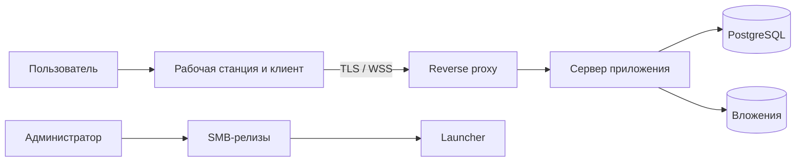

# Безопасность и эксплуатация

## 1. Модель доверия

Система работает внутри организации, но внутренняя сеть, SMB-ресурс и рабочая станция не считаются безусловно доверенными. Сервер остается единственной стороной, принимающей решения о правах.

Защищаемые активы:

- учетные данные и активные сессии;
- содержание сообщений и вложений;
- оргструктура, роли и области полномочий;
- квитанции критичных сообщений и аудит;
- релизные бинарники и серверная конфигурация;
- резервные копии и ключи подписи.

Основные границы доверия:

## 2. Аутентификация и сессии

- Локальную учетную запись создает администратор. Пользователь при первом входе меняет временный пароль.
- Пароли хешируются Argon2id с уникальной солью и параметрами, зафиксированными по результатам измерений на серверном оборудовании. Исходные пароли не логируются и не восстанавливаются.
- Access token короткоживущий; refresh token ротируется при каждом использовании. Повтор старого refresh token отзывает всю связанную цепочку.
- Access token хранится только в памяти клиента. Refresh token хранится в защищенном хранилище учетных данных ОС; при его отсутствии постоянный вход отключается.
- Блокировка пользователя, административный сброс пароля и явный выход отзывают соответствующие сессии.
- Сервер ограничивает частоту входа по логину и источнику, применяет нарастающую задержку и создает security-событие при серии ошибок.
- Политика сложности, сроки токенов и порядок передачи временного пароля остаются [открытыми решениями](open-questions.md).

## 3. Авторизация

Проверка выполняется сервером в три шага:

1. Аутентифицирован ли пользователь и не заблокирован ли он.
2. Есть ли требуемое разрешение у базовой роли или дополнительного назначения.
3. Входит ли объект операции в область действия назначения.

Базовые группы разрешений:

| Группа | Примеры |
| --- | --- |
| `organization.manage` | Пользователи, подразделения, группы и теги |
| `roles.manage` | Роли, разрешения и scope |
| `channels.manage` | Создание и архивирование служебных/тематических каналов |
| `messages.moderate` | Закрепление и административный отзыв |
| `critical.send` | Критичное сообщение в разрешенной области |
| `announcements.send` | Предпросмотр и отправка разрешенной аудитории |
| `announcements.stats` | Списки и агрегаты квитанций |
| `audit.read` | Просмотр административного аудита |
| `policies.manage` | Хранение, лимиты и параметры продукта |

Изменение прав применяется к следующим запросам немедленно. Клиентское меню обновляется событием, но устаревший UI не дает возможности обойти серверную проверку.

## 4. Защита данных

- Внешний интерфейс сервера доступен только по HTTPS/WSS с сертификатом внутреннего CA. HTTP либо отключен, либо перенаправляется до обработки учетных данных.
- Доверие к внутреннему CA распространяется штатными средствами организации. Встраивание приватного CA непосредственно в исполняемый файл не допускается.
- Сквозного шифрования нет: сервер обрабатывает текст для поиска, аудиторий, квитанций, резервирования и политик хранения.
- Шифрование PostgreSQL, volume вложений и резервных копий обеспечивается средствами ОС/хранилища. Ключи не размещаются рядом с копиями.
- SQLite-кеш приложения не шифруется самим продуктом и находится в профиле пользователя с минимальными правами. Требуется шифрование системного диска политикой организации.
- При отзыве сессии клиент удаляет токены. При отзыве доступа к ресурсу удаляются связанные записи и локальные копии вложений. Полная очистка профиля предоставляется отдельным действием «Удалить локальные данные».
- Секреты, токены, пароли и текст сообщений исключаются из технических логов и crash-отчетов.

## 5. Вложения

- Клиент и сервер независимо применяют текущий лимит; сервер является источником истины.
- Имя файла нормализуется для отображения и никогда не используется как storage path.
- MIME-тип клиента считается подсказкой, скачивание отдается как attachment с безопасным именем и заголовками.
- Доступ проверяется на каждом скачивании по текущему членству или снимку аудитории.
- Временные и непривязанные файлы удаляются плановой задачей.
- В MVP нет антивирусного сканирования и запрета исполняемых форматов. Это принятый риск: защита рабочих станций и серверного volume обязательна на инфраструктурном уровне. Решение пересматривается до промышленного релиза.

## 6. Аудит

Аудит хранит действия и метаданные, но не отдельную копию текста сообщений.

Обязательные события:

- успешный вход, неуспешные попытки, выход и отзыв сессии;
- создание, блокировка, восстановление и изменение пользователя;
- изменения подразделений, групп, тегов, ролей и scope;
- создание/архивирование канала и изменение членства;
- предпросмотр, отправка и отзыв объявления;
- отправка и отзыв критичного сообщения;
- административное удаление, изменение политик и лимитов;
- запуск восстановления из резервной копии и изменение релизного manifest.

Событие содержит время, актера, действие, тип/ID объекта, результат, correlation ID и безопасные diff-метаданные. Обычный пользовательский текст, пароль, токен и содержимое вложения не включаются. Доступ к журналу отделен разрешением `audit.read`, а выгрузка сама создает событие аудита.

## 7. Хранение и удаление

- До назначения политики сообщения и вложения не удаляются автоматически.
- Политика задается по типу чата или объекта и может уточняться областью организации.
- Удаление выполняется фоновыми пакетами: сначала контент и вложения становятся недоступны, затем физически очищаются после периода восстановления.
- Системные метаданные, необходимые для доказательства отправки/отзыва и аудита, могут иметь отдельный срок.
- Изменение политики применяется только после preview количества и возраста затрагиваемых объектов и явного подтверждения администратора.
- Legal hold и регуляторные исключения не проектируются до появления соответствующего требования.

## 8. Резервное копирование и восстановление

Копия должна охватывать PostgreSQL, volume вложений, серверную конфигурацию без секретов, версию образов и публичные сертификаты. База и файлы должны относиться к согласованной точке либо иметь процедуру сверки после восстановления.

Минимальная процедура:

1. Создать копию БД и вложений в изолированное хранилище.
2. Проверить checksum, читаемость и наличие manifest копии.
3. Развернуть копию в отдельном восстановительном контуре.
4. Проверить вход тестового администратора, историю, выборочное скачивание и ссылочную целостность.
5. Зафиксировать длительность, потерянное окно и результат в операционном журнале.

Промышленный запуск запрещен до выбора RPO/RTO, расписания, срока хранения и владельца тестов восстановления.

## 9. Автономная поставка сервера

- Комплект включает versioned OCI-образы, Compose-файл, миграции, SBOM, checksum и инструкции отката.
- Образы собираются вне изолированного контура, проверяются и переносятся утвержденным способом.
- Миграция БД выполняется отдельной контролируемой командой перед переключением приложения и должна иметь проверку совместимости.
- Конфигурация передается через файлы/секреты хоста; значения по умолчанию не содержат production-паролей.
- Reverse proxy завершает TLS, ограничивает размер запросов и задает безопасные таймауты для WebSocket и загрузок.

## 10. Launcher и клиентские релизы

- Launcher читает manifest с SMB, проверяет цифровую подпись manifest и SHA-256 клиентского файла.
- Копирование выполняется во временный локальный каталог; активация версии — атомарным переименованием после проверки.
- При недоступности SMB или поврежденном новом релизе запускается последняя локальная проверенная совместимая версия.
- Хранятся текущая и предыдущая версии. Автоматическое удаление не затрагивает запущенный процесс.
- Manifest может запретить слишком старую версию клиента при несовместимом серверном контракте.
- Закрытый ключ подписи хранится вне SMB и build-артефактов. Алгоритм, владелец и процедура ротации определяются до пилота.

## 11. Мониторинг и реагирование

Для внутреннего мониторинга публикуются health/readiness и аутентифицированные метрики. Проверяются доступность API, PostgreSQL и volume, задержка outbox, число WebSocket, частота ошибок, свободное место и возраст backup.

События уровня инцидента: массовые ошибки входа, повреждение вложений, отставание outbox, заполнение диска, неуспешная копия, несоответствие подписи релиза и повтор отозванного refresh token. Контакты, уровни критичности и сроки реакции оформляются перед пилотом в runbook.

