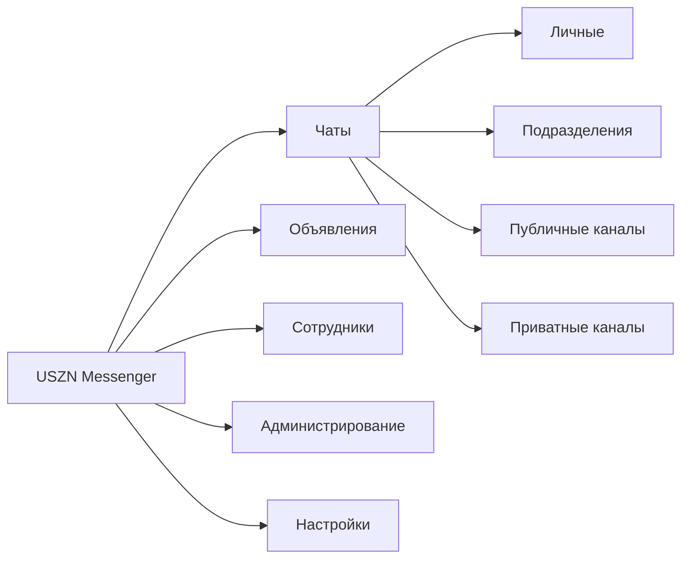

# UX-спецификация desktop-клиента

## 1. Принципы

- Интерфейс оптимизирован для рабочего desktop-окна, высокой плотности информации и управления мышью или клавиатурой.
- Навигация не копирует конкретный продукт, но использует знакомую модель Discord/Mattermost: список диалогов, центральная переписка и контекстная правая панель.
- Состояния доставки, критичности, офлайн-очереди и ограничений доступа показываются явно, без зависимости только от цвета.
- Темная и светлая темы используют одинаковую иерархию и размеры; переключение темы не меняет компоновку.

## 2. Информационная архитектура



Раздел «Администрирование» виден только при наличии административных разрешений. Коммуникатору доступно создание объявления, но не управление пользователями, если это отдельно не разрешено.

## 3. Основная компоновка

```text
┌──────────────────────┬──────────────────────────────────────┬──────────────────────┐
│ Навигация и чаты     │ Заголовок текущего чата              │ Контакты / участники │
│                      ├──────────────────────────────────────┤                      │
│ Поиск                │                                      │ Поиск по списку      │
│ Объявления           │ История сообщений                    │ Статус и роль         │
│ Закрепленные         │                                      │                      │
│ Личные               │                                      │                      │
│ Подразделения        ├──────────────────────────────────────┤                      │
│ Каналы               │ Вложения | поле ввода | отправить    │                      │
└──────────────────────┴──────────────────────────────────────┴──────────────────────┘
```

- Левая панель: глобальный поиск, «Объявления», фильтры и активные чаты. Непрочитанное обозначается счетчиком и акцентом.
- Центральная панель: заголовок, закрепления/поиск по чату, виртуализированная история и composer внизу.
- Правая панель: в личном чате — карточка собеседника и общие файлы; в канале — участники, роли и статусы; в объявлениях — фильтры и краткая статистика.
- Панели имеют минимальную ширину. При недостатке места правая панель сворачивается кнопкой, центральная остается приоритетной.

## 4. Список и история сообщений

Сообщения группируются по автору и близкому времени. Для каждого сообщения доступны время, отметка редактирования, реакции, цитата, вложения и контекстное меню согласно правам.

Состояния:

- отправляется — локальная очередь, нейтральный индикатор;
- отправлено — сервер принял команду;
- ошибка — очередь остановлена для элемента, доступны повтор и удаление;
- отозвано/удалено — содержимое заменено системной карточкой;
- критичное — отдельная рамка, срок и кнопка «Ознакомлен»;
- упоминание — визуальный акцент и переход из списка непрочитанного.

Критичная карточка не использует одну лишь красную окраску: рядом присутствуют текстовая метка, пиктограмма и срок. После подтверждения кнопка заменяется временем ознакомления.

## 5. Composer

Composer всегда расположен внизу центральной панели и содержит:

- многострочное поле; `Enter` отправляет, `Shift+Enter` добавляет строку;
- выбор вложения и список подготовленных файлов с размером и ошибками;
- контекст ответа с отменой;
- подсказки пользователей и тегов после `@`;
- кнопку отправки и состояние соединения;
- переключатель критичности только при наличии разрешения.

В офлайн-режиме текст можно отправить в очередь. Composer заранее предупреждает, что новые вложения не будут загружены до восстановления связи.

## 6. Объявления

Раздел содержит входящие объявления и, при наличии прав, кнопку «Создать».

Поток создания:

1. Заголовок, текст и вложения.
2. Выбор организации, подразделений, групп и тегов в пределах области действия.
3. Необязательная критичность и обязательный срок ознакомления для критичного объявления.
4. Предпросмотр дедуплицированной аудитории и предупреждения о пустых/недоступных выборках.
5. Финальное подтверждение.

После отправки автор видит карточки «доставлено», «просмотрено», «ознакомлен» и «ожидают». Отзыв требует причины и дополнительного подтверждения.

## 7. Присутствие и DND

Меню профиля позволяет выбрать «Работаю», «Отошел» или DND, текст статуса и срок. «Не в сети» устанавливается системой. Автоматический переход в «Отошел» в прототипе имитируется управляющим сценарием.

При включении DND пользователь вводит или выбирает автоответ. Интерфейс явно сообщает: подавляются все уведомления, включая критичные. В истории собеседника автоответ отображается как системное сообщение и не запускает другие автоответчики.

## 8. Администрирование

Административная область включает:

- пользователей и блокировку учетных записей;
- дерево подразделений;
- группы и теги;
- публичные, приватные и служебные каналы;
- роли, разрешения и области действия;
- политики хранения и лимит вложений;
- аудит административных событий.

В UX-прототипе формы меняют только мок-состояние текущего запуска. Опасные действия требуют подтверждения и показывают предполагаемый результат.

## 9. Системные состояния

| Состояние | Поведение |
| --- | --- |
| Первый запуск | Экран launcher/configuration, затем локальный вход |
| Загрузка | Каркас текущей компоновки без скачков размеров |
| Нет результатов | Объяснение причины и релевантное действие |
| Нет доступа | Сообщение без раскрытия существования закрытого ресурса |
| Соединение потеряно | Постоянный баннер, время последней синхронизации, очередь |
| Синхронизация | Прогресс без блокировки чтения кеша |
| Сессия отозвана | Очистка токенов и возврат на вход; политика кеша описана отдельно |
| Несовместимая версия | Блокирующий экран с переходом к launcher |

## 10. Приемка UX-прототипа

Прототип собирается как Wails-приложение для целевых ОС, не обращается к серверу и стартует с одинаковым набором мок-данных. В специальной панели сценариев можно имитировать роль, соединение, входящие события и течение времени.

Обязательные демонстрации:

1. Локальный вход и переход между личным чатом, публичным, приватным и служебным каналами.
2. Отправка, цитата, редактирование, мягкое удаление, реакция, закрепление, поиск и `@`-упоминание.
3. Загрузка допустимого вложения и ошибка превышения лимита.
4. Создание объявления, дедупликация аудитории и статистика прочтения.
5. Критичное сообщение: доставка, просмотр, «Ознакомлен», истекший срок и напоминание автору.
6. DND, подавленное критичное уведомление и единственный автоответ.
7. Потеря соединения, очередь текста, восстановление и отсутствие визуального дубликата.
8. Переключение ролей и демонстрация скрытых/запрещенных действий.
9. Переключение тем и сворачивание правой панели при уменьшении окна.

